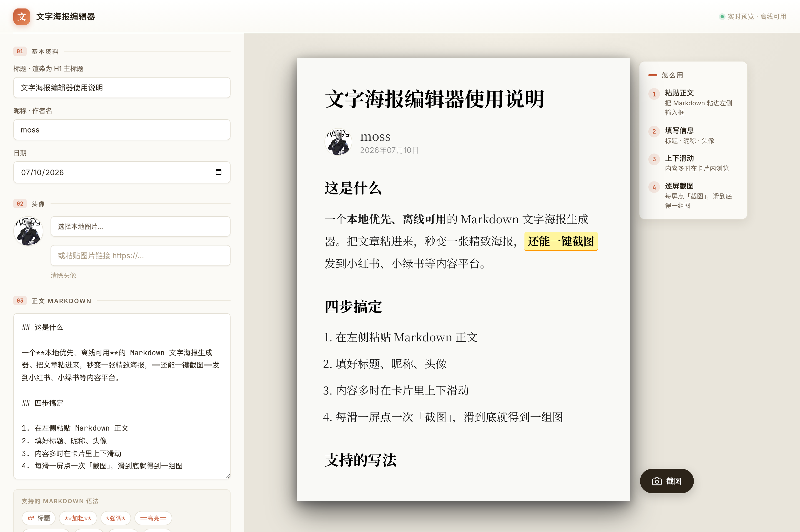

# 文字海报编辑器

> 本地优先、离线可用的 Markdown 文字海报生成器。
>
> 粘贴 Markdown，填好标题、昵称、头像，右侧立刻生成一张 600×800 的精致文字海报。内容多时可以在卡片里上下滑动：**滑一屏、点一次「截图」**，导出当前这一屏的 PNG；一路滑到底，就得到一组能连贯阅读、尺寸比例也适合发布到内容平台（比如小红书、小绿书等）的图片集。



## 在线体验

**https://loonggg.github.io/wenzi-poster-editor/**

打开后点浏览器地址栏的「安装」图标，即可作为独立应用装到桌面或手机，离线也能用。

## 功能

- **Markdown 实时渲染**：标题、列表、引用、代码块、链接、加粗、`==高亮==` 等
- **预设海报样式**：600×800 米白卡片配深色背景，思源宋体排版
- **自定义信息**：标题（H1）、昵称、日期、头像（本地上传或图片链接）
- **一键截图导出**：按卡片尺寸 2 倍精度导出 PNG，文件名自动取标题
- **离线可用（PWA）**：字体与解析库全部本地打包，断网照常使用
- **浅色纸感界面**：简约、有质感

## 本地使用

无需安装、无需联网。下载本项目后双击 `index.html` 即可在浏览器打开使用。

> 本地以 `file://` 打开时，Service Worker 与「安装」提示不生效（需 HTTPS 环境），属正常现象；编辑和截图功能不受影响。

## 部署到你自己的 GitHub Pages

1. 新建一个 Public 仓库，把本项目文件推上去。
2. 仓库 **Settings → Pages → Source** 选 `Deploy from a branch`，Branch 选 `main` / `(root)`。
3. 等待 1–2 分钟，访问 `https://<你的用户名>.github.io/<仓库名>/`。

## Markdown 语法速查

| 写法 | 效果 |
|------|------|
| `## 标题` | 二级标题 |
| `**加粗**` | **加粗** |
| `==高亮==` | 黄底高亮 |
| `> 引用` | 引用块 |
| `` `代码` `` | 行内代码 |
| ``` ```代码块``` ``` | 代码块 |

## 项目结构

```
├── index.html              # 编辑器主页面
├── manifest.webmanifest    # PWA 清单
├── sw.js                   # Service Worker（离线缓存）
├── marked.min.js           # Markdown 解析库
├── html2canvas.min.js      # 截图导出库
├── icons/                  # 应用图标
├── fonts/                  # 本地字体（思源宋体已 subset 至约 5.5M）
└── docs/preview.png        # README 预览图
```

## 致谢与许可

- [marked](https://github.com/markedjs/marked) — Markdown 解析（MIT）
- [html2canvas](https://github.com/niklasvh/html2canvas) — 截图导出（MIT）
- [Noto Serif SC](https://fonts.google.com/noto/specimen/Noto+Serif+SC) · [Inter](https://fonts.google.com/specimen/Inter) · [JetBrains Mono](https://www.jetbrains.com/lp/mono/) — 字体（OFL / OFL / Apache-2.0）
